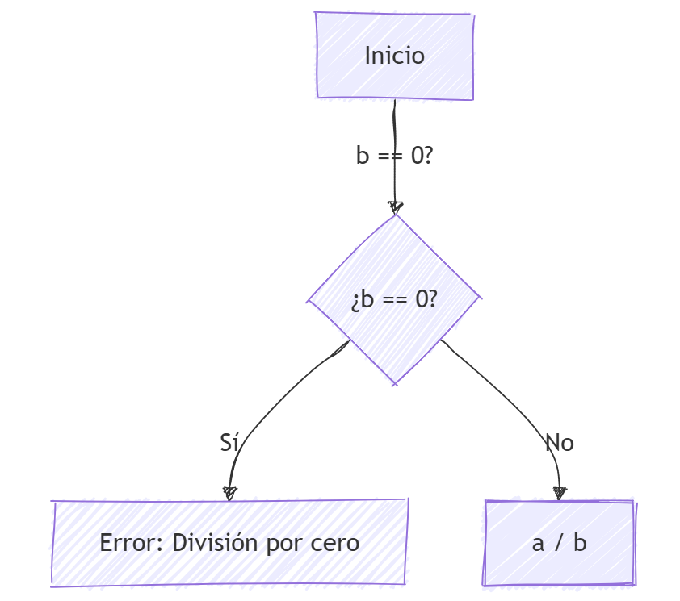
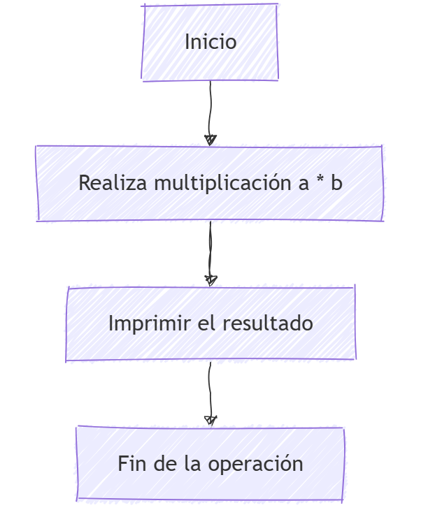

# PPS-Unidad1Actividad3-Raul_Albalat_Perez
# **Análisis de Grafos de Flujo y Estrategias de Pruebas**  

En esta práctica, analizamos los grafos de flujo correspondientes a las funciones `division` y `multiplicacion`, identificando los caminos posibles en su ejecución. Además, evaluamos estrategias de prueba basadas en caja blanca y caja negra.  

## **1. Grafo de Flujo para la Función `division`**  

### **Código de la función**  
```python
def division(a, b):
    if b == 0:  # Nodo B
        return "Error: División por cero"  # Nodo C
    return a / b  # Nodo D y E
```

### **Descripción del flujo de control**  
- **A[Inicio]**: Es el punto de inicio del proceso.
- **B{¿b == 0?}**: Se pregunta si `b` es igual a cero.
- **C[Error: No dividir entre cero]**: Si la respuesta es "Sí", se muestra el mensaje de error.
- **D[Realizar la división a / b]**: Si la respuesta es "No", se realiza la división.
- **E[Imprimir el resultado]**: Luego, se imprime el resultado de la división.
- **F[Fin de la operación]**: Finalmente, se termina la operación.

### **Diagrama del Grafo de Flujo**  
```
    (A) [Inicio]
        |
    (B) b == 0 ?
      /     \
    Sí       No
   (C)       (D)
    |       a / b
    |         |
Error:     (E)impr result 
     \        / 
   (F)fin de operacion
```



## **2. Grafo de Flujo para la Función `multiplicacion`**  

### **Código de la función**  
```python
def multiplicacion(a, b):
    return a * b  # Nodo B y C
```

### **Descripción del flujo de control**  
- **A[Inicio]**: Este es el punto de inicio de la función.
- **B[Realizar multiplicación a * b]**: En este paso, la función realiza la multiplicación entre los dos parámetros `a` y `b`.
- **C[Imprimir el resultado]**: Después de la multiplicación, el resultado se imprime en la salida.
- **D[Fin de la operación]**: Finalmente, la operación termina.

### **Diagrama del Grafo de Flujo**  
```
    (A) [Inicio]
         |
   (B) a * b
         |
   (C) impr result
         |
   (D) Fin de operacion       
```


---

#  Estrategias de Pruebas

[## Test de clases de equivalencia y valores límites para la función](Test_calculadoraRaul.ipynb)
