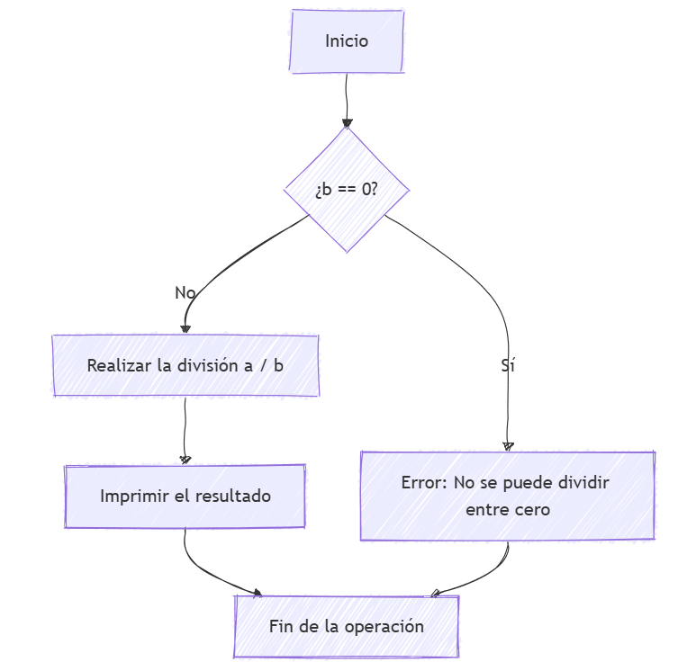

# PPS-Unidad1Actividad3-Raul_Albalat_Perez
# **Análisis de Grafos de Flujo y Estrategias de Pruebas**  

En esta práctica, analizamos los grafos de flujo correspondientes a las funciones `division` y `multiplicacion`, identificando los caminos posibles en su ejecución. Además, evaluamos estrategias de prueba basadas en caja blanca y caja negra.  

## **1. Grafo de Flujo para la Función `division`**  

### **Código de la función**  
```python
def division(a, b):
    if b == 0:  # Nodo 1
        return "Error: División por cero"  # Nodo 2
    return a / b  # Nodo 3
```

### **Descripción del flujo de control**  
- **A[Inicio]**: Es el punto de inicio del proceso.
- **B{¿b == 0?}**: Se pregunta si `b` es igual a cero.
- **C[Error: No dividir entre cero]**: Si la respuesta es "Sí", se muestra el mensaje de error.
- **D[Realizar la división a / b]**: Si la respuesta es "No", se realiza la división.
- **E[Imprimir el resultado]**: Luego, se imprime el resultado de la división.
- **F[Fin de la operación]**: Finalmente, se termina la operación.

### **Diagrama del Grafo de Flujo**  
```
    (A) [Inicio]
        |
    (B) b == 0 ?
      /     \
    Sí       No
   (C)       (D)
    |       a / b
    |         |
Error:     (E)impr result 
     \        / 
   (F)fin de operacion
```



## **2. Grafo de Flujo para la Función `multiplicacion`**  

### **Código de la función**  
```python
def multiplicacion(a, b):
    return a * b  # Nodo único
```

### **Descripción del flujo de control**  
1. **Inicio (Nodo 1):** La función realiza la operación `a * b` y retorna el resultado sin ninguna bifurcación.  

### **Diagrama del Grafo de Flujo**  
```
    (1) [Inicio]
        |
      a * b
```


